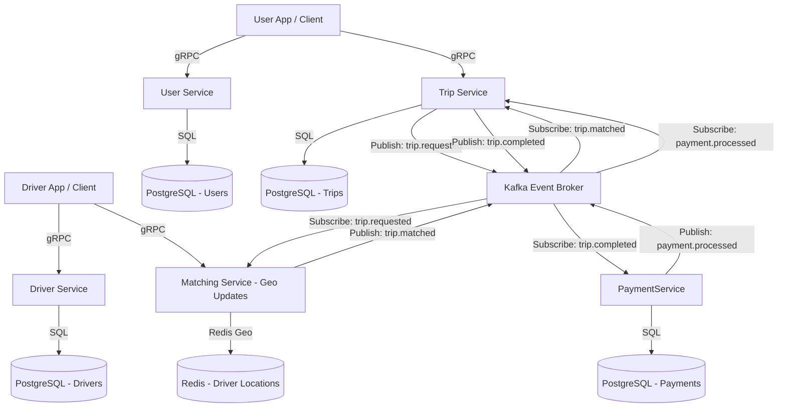

# RideFlow: Distributed Ride-Hailing Platform

RideFlow is a high-performance, event-driven, distributed ride-hailing backend platform engineered in Go. Designed with scalability and reliability in mind, it decomposes the typical ride-hailing lifecycle into five distinct, loosely-coupled microservices.

## 🚀 Key Features
* **Distributed Microservices**: User, Driver, Trip, Matching, and Payment services written in Go, structured and managed via **Uber Fx** dependency injection.
* **Low-Latency Geospatial Queries**: Real-time driver location tracking, state management, and proximity searches using **Redis Geospatial indexes** (`GEOADD`, `GEOSEARCH`).
* **Event-Driven Workflows**: Asynchronous decoupling of ride requests, driver dispatch, status updates, and payment processing using **Apache Kafka** event streams.
* **Synchronous Inter-service Communication**: Fast, schema-enforced, and strongly typed **gRPC** interfaces.
* **Production-Grade Infrastructure**: Clean database normalization in **PostgreSQL**, containerized services, and cloud-ready **Kubernetes** configurations.

---

## 🏗️ System Architecture

RideFlow is structured to optimize transactional throughput and maintain low-latency response times for matching. Below is the layout of the communication paths and event flows between the services:

---

## 📦 Microservices Breakdown

### 1. User Service
* **Responsibility**: Manages rider accounts, security, and profile metadata.
* **Tech Stack**: Go, Uber Fx, gRPC, PostgreSQL, JWT.
* **Key Feature**: Schema-enforced user profiles and secure authentication.

### 2. Driver Service
* **Responsibility**: Manages driver profiles, vehicle associations (cabs), rating statistics, and active shifts.
* **Tech Stack**: Go, Uber Fx, gRPC, PostgreSQL.
* **Key Feature**: Tracks vehicle configurations (Micro, Mini, SUV, Luxury) and driver ratings.

### 3. Trip Service
* **Responsibility**: Acts as the central coordinator of the ride lifecycle.
* **Tech Stack**: Go, Uber Fx, gRPC, PostgreSQL, Kafka Producer/Consumer.
* **Key Feature**: Orchestrates states (`REQUESTED`, `MATCHED`, `ARRIVED`, `STARTED`, `COMPLETED`, `CANCELED`) and publishes lifecycle events to Kafka.

### 4. Matching Service
* **Responsibility**: Pairs passenger ride requests with nearby, online, and eligible drivers.
* **Tech Stack**: Go, Uber Fx, gRPC, Redis (Geospatial), Kafka Consumer/Producer.
* **Key Feature**: Consumes `trip.requested` events, queries Redis using `GEOSEARCH` to find drivers within a given radius, assigns the closest driver, and publishes `trip.matched`.

### 5. Payment Service
* **Responsibility**: Performs transaction processing once a ride is completed.
* **Tech Stack**: Go, Uber Fx, gRPC, PostgreSQL, Kafka Consumer/Producer.
* **Key Feature**: Processes simulated transactions and raises billing confirmation events.

---

## 🛠️ Technology Stack & Rationale

* **Go (Golang)**: Chosen for its lightweight footprint, fast compilation, and superior concurrency model (goroutines) suitable for network-heavy microservices.
* **Uber Fx**: A modular dependency injection framework that standardizes service bootstrap, dependency wiring, and graceful shutdown lifecycles.
* **gRPC / Protocol Buffers**: Provides high-performance, binary-serialized synchronous communication, avoiding the overhead of JSON parsing over HTTP/1.1.
* **Apache Kafka**: Serves as the backbone for the platform's eventual consistency. Enables high-throughput message ingestion and fault-tolerant event processing.
* **Redis**: Used specifically for its sub-millisecond read/write speeds on geospatial coordinates, critical for tracking high-frequency driver ping locations.
* **PostgreSQL**: Used for transactional consistency (ACID compliant) to store customer accounts, driver stats, trip records, and payment receipts.

---

## 🗺️ Implementation Roadmap

* **Phase 1**: Workspace Monorepo Setup, Protobuf definitions, Docker-Compose, Uber Fx stubs.
* **Phase 2**: User & Driver services implementation + DB Schema.
* **Phase 3**: Trip lifecycle management & Kafka event broker wiring.
* **Phase 4**: Redis Geospatial tracking & Matching engine.
* **Phase 5**: Payment processing, mock gateway, and completion hooks.
* **Phase 6**: Containerization (Docker), Kubernetes manifests, Prometheus logging, and observability dashboards.
